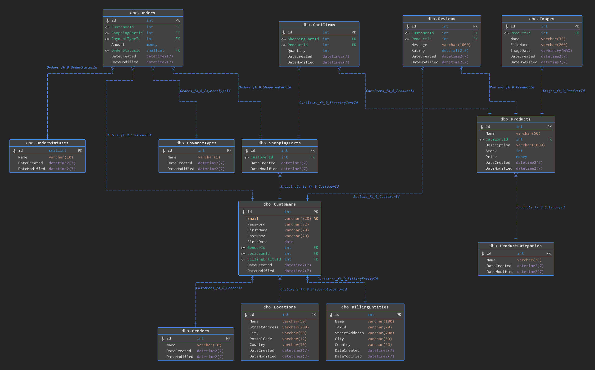

# SQL database design for an online store

[Here you can view the full database creation script](OnlineStore.sql)

## Database tables details

* [Customers](dbo.customers.md)
* [Genders](dbo.genders.md)
* [Locations](dbo.locations.md)
* [Billing Entities](dbo.billing_entities.md)
* [Products](dbo.products.md)
* [Product Categories](dbo.product_categories.md)
* [Images](dbo.images.md)
* [Reviews](dbo.reviews.md)
* [Orders](dbo.orders.md)
* [Order Statuses](dbo.order_statuses.md)
* [Shopping Carts](dbo.shopping_carts.md)
* [Cart Items](dbo.cart_items.md)
* [Payment Types](dbo.payment_types.md)
